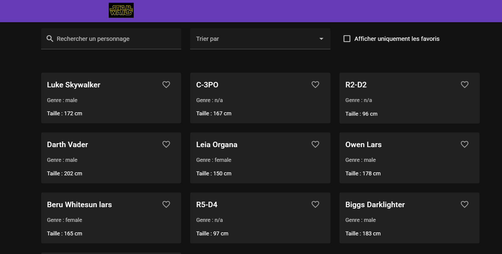
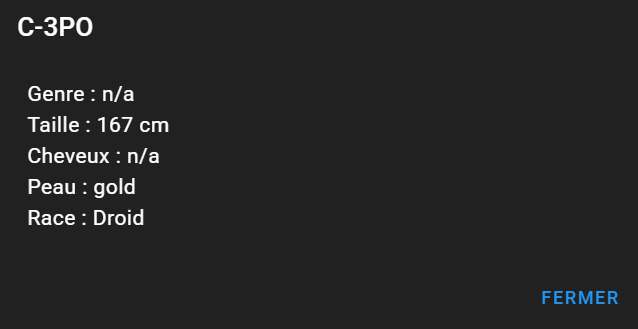

# 🌐 Mon Projet Vue.js & Vuetify

## 1. 🎨 Présentation du projet

### Concept
- API : Swapi Pourquoi : J'ai choisi Swapi car je n'avais pas trop d'idée et j'aime bien Star Wars
- Les fans de Star Wars afin qu'ils puissent avoir divers informations sur des personnages  
- Afficher des personnages, afficher des détails sur les personnages, tri (favoris, a-z, z-a), rechercher
  des personnages, mettre en favoris des personnages

### Fonctionnalités principales
- Affichage d’une liste de personnages Star Wars
- Barre de recherche
- Tri A-Z, Z-A, par favoris
- Mettre en favoris les personnages
- Affichage des détails des personnages en clicant dessus

### Aperçu visuel

---

## 2. 📚 Parcours d'apprentissage

### Ressources utilisées
#### Documentation & tutos
- [Vue 3 Docs](https://vuejs.org/guide/introduction.html)
- [Vuetify Docs](https://vuetifyjs.com/en/components/all/)
- [Pinia Docs](https://pinia.vuejs.org/)
- [Public APIs List](https://github.com/public-apis/public-apis)
- Chat-GPT 4

#### Progression
- Semaine 1 : Création du projet github + réalisation du sitemap du projet
- Semaine 2 : Récupération des personnages Star Wars à l'aide de l'API
- Semaine 3 : Avancement dans le code de la page (ajout des cartes pour les personnages)
- Semaine 4 : Avancement dans le code de la page (ajout de la barre de recherche, du tri (A-Z, Z-A, favoris), 
              et ajout des favoris)

---

## 3. 🛠️ Outils et méthodologie

### Environnement de développement
- **IDE** : VS Code / WebStorm / Node.js
- **Versioning** : Git + GitHub
- **Dépendances principales** : Vue 3, Vuetify 3, Pinia, Axios/Fetch
- **Gestion API Keys** : `.env` + `.env.example`

### Installation & Run
- Cloner le repo : https://github.com/divtec-cejef/m294-projet-vuetify-NGUYTAO
- Installer : utiliser la commande : npm install
- Lancer : utiliser la commande : npm run dev
- Variables d’environnement : copier `.env.example` → `.env` et compléter les clés nécessaires  

### Méthodologie
- Découpage en composants réutilisables
- Props & Emits clairs
- Store global avec Pinia
- Commits réguliers et explicites
- Tests manuels (UI, persistance, erreurs API)

### Choix techniques
- API sélectionnée : Swapi
- Justification du choix : Car j'aime bien Star Wars et elle est gratuite
- Endpoints utilisés : https://swapi.dev/api/people/
- Limites/quotas connus :  

### Architecture (Descriptif + schéma simple + data-flow)
- `App.vue` : layout principal  
- `views/` : pages (liste, détail, favoris)  
- `components/BarreFiltre.vue` : Barre de recherche + menu déroulant pour le tri + case à cocher pour favoris
- `components/PersonnageCard.vue` : Carte contenant les personnages pour l'affichage
- `components/AppHeader.vue` : Barre d'en-tête + logo Star Wars

**Data-flow résumé :**  
- Vue déclenche un **event utilisateur** → composant appelle une fonction du **store** → ...

---

## 4. 🧪 Tests et validation

### Tests techniques
- ✅ Appels API fonctionnels  
- ✅ Persistance vérifiée après refresh (localStorage)  
- ✅ Navigation entre les vues OK  
- ✅ Tri et recherhce dynamique OK

### Tests d’UX
- Navigation intuitive  
- Recherche/filtre/tri faciles à comprendre  
- Feedback utilisateur (loading, erreurs, vide)  
- Bouton favoris intuitif et visible sur chaque carte

### Tests d’accessibilité
- Contraste couleurs (Vuetify par défaut)  
- Labels et placeholders corrects  
- Navigation clavier possible  
- Focus visible  
- ...

### Tests d’erreurs & fallback
- API down → **mock fallback** affiché (fichier local ou données simulées)  
- Liste vide → message clair affiché  
- Recherche sans résultat → affichage “Aucun personnage ne correspond à votre recherche.”

---

## 5. 🤖 Usage d’intelligence artificielle

**⚠️ TRANSPARENCE OBLIGATOIRE** : Si vous utilisez une IA, vous DEVEZ :

### IA utilisée
- **Nom** : ChatGPT
- **Version** : GPT-4
- **Contexte** : Aide ponctuelle / Génération de code / Debugging  

### Utilisation détaillée
**Domaines d'aide :**
- Aide au code général : 50%
- Génération de snippets Vue/Vuetify : 50%
- Aide à la structuration du projet : 0%
- Debugging : 50%
- Recherche d’idées : 0%

**Compréhension et adaptation**
- Le code généré m'a aidé à créer des fonction de A-Z, de débuguer des bouts de code, de m'aider 
  si je ne savais pas quel composants vue utilisé
- Tout les bouts de codes que j'ai pris ou l'aide que j'ai reçu se sont parfaitement adapté

### Parties codées manuellement
- Composants principaux : 50% personnel  
- Store & persistance : 75% personnel  
- Routing & navigation : 50% personnel  
- Tests & validation : 100% personnel  

### Apprentissage personnel
- Elle m'a appris à utilisé Vue 3, gérer un store(Pinia), gérer des routes
- Elle m'a aidé à progresser car je lui ai toujours demandé de m'expliquer en détail afin de toujours savoir ce que
  j'utilise qui provient de l'IA

---

## 6. 🎯 Bilan personnel

### Ce que j’ai appris
- J'ai appris à créer un site avec un store et qui fait appel à une API 
- Découvertes surprenantes  
- Concepts difficiles maîtrisés  

### Difficultés rencontrées
- J'ai eu un problème ou ça ne m'affichait pas mes cartes, ça affichait uniquement le message qui dit qu'il
  n'y a aucun personnages trouvé
- J'ai eu des blocage au niveau du store mais j'ai réussi à résoudre les problèmes 
- Aide reçu de Chat-GPT 

### Réussites et fiertés
- Je suis plutôt fier de la structure de mon projet (diviser en composant, store, etc.) 
- Je me suis nettement améliorer en vue.js comparé au début ou je trouvais ça vraiment difficile maintenant
  je trouve que c'est plus de niveau intermédiaire
- Ajout de + de choses dans mon "catalogue" car il y a que peu de personnages peut être ajouter des vaisseaux
  ou autre

### Améliorations possibles
- J'ajouterai les vaisseaux dans mon catalogue avec leur équipages, etc. 
- Système de comparaison de personnages
- Réussir à changer l'URL au moment ou je clique pour voir les détails d'un personnage

---

## 7. 📚 Références & Sources
- Documentation de l’API : [Nom de l’API](https://...)  
- Tutos clés utilisés : Exercice pokémon : https://devjs.ch/exercices/pokedex-vuetify/  
- Usage de l’IA : oui, uniquement Chat-GPT
- Autres ressources utiles : Je n'ai pas spécialement utilisé d'autre ressources
